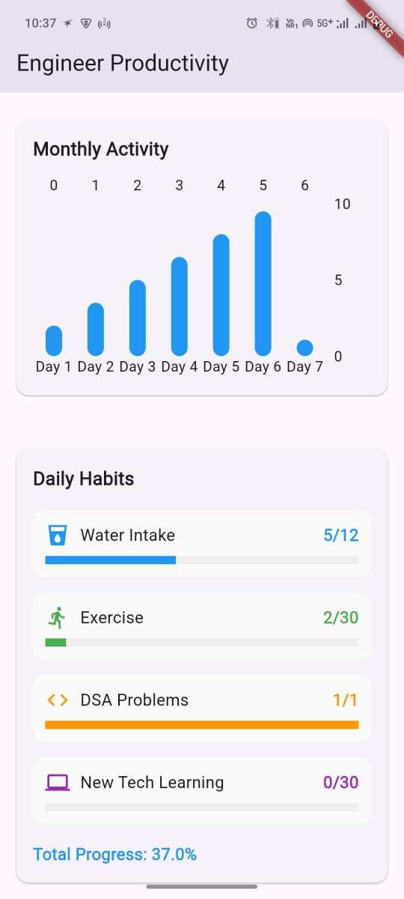
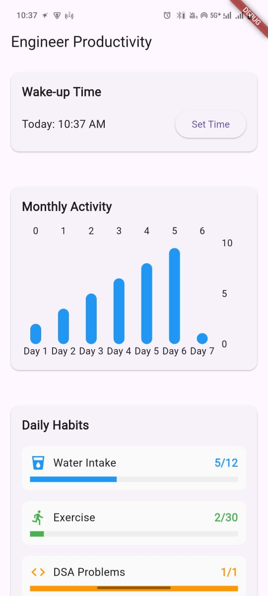

# Engineer Productivity 🚀 – A Daily Habit Tracker for Engineers

**Engineer Productivity** is my first Flutter app – a simple and effective productivity tracker designed especially for engineers and tech learners. It helps you stay consistent with key daily habits like waking up on time, staying hydrated, exercising, solving DSA problems, and learning new tech – all visualized in a clean, motivating layout.

---

## 🛠 Features

- ⏰ **Wake-Up Time Tracker**  
  Log your daily wake-up time and view it in a GitHub-like activity chart to stay on track.

- 💧 **Water Intake Tracker**  
  Track 12 glasses of water a day with simple, tappable icons.

- 🏃‍♂️ **Exercise Tracker**  
  Record 30 minutes of exercise each day to keep fit.

- 🧠 **DSA Problem Tracker**  
  Mark one Data Structures & Algorithms problem as done each day.

- 💻 **New Tech Learning Tracker**  
  Spend 30 minutes daily on tech learning and optionally note what you explored.

---

## 💾 Storage

- All data is stored **locally on your device** using `shared_preferences`.  
  No account or internet connection is required – your progress is saved offline.

---

## 📱 Screenshots

---

## 📦 Tech Stack

- **Flutter** – UI toolkit by Google
- **Dart** – Programming language
- **shared_preferences** – Local storage

---

## 🚧 Status

✅ The core version of the app is **complete**.  
This is my first Flutter project, and I’ve learned a lot during the process. I plan to keep improving it and adding new features with time.

---

## 🙋‍♂️ Why I Built This

As a developer and student, I wanted to build something that helps people like me form healthy, productive habits. I also wanted to get hands-on experience with Flutter and mobile app development — and this app is the start of that journey.

---

## 🧠 What I Learned

- Flutter UI basics: `Column`, `Row`, `Container`, `ListView`, etc.
- Local data storage using `shared_preferences`
- Managing state and user input
- App structuring and widget creation
---

## 💬 Connect

If you try the app or have feedback, I’d love to hear from you.  
This is just the start, and I’m excited to learn and build more!
